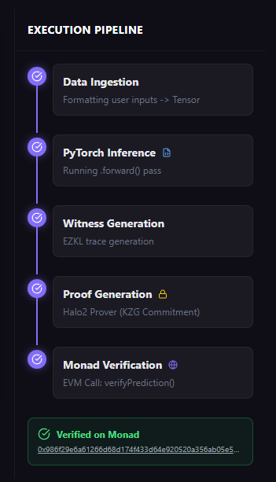
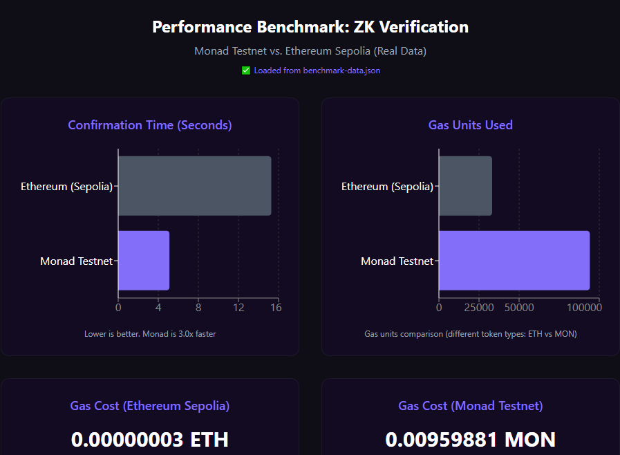

## Monad ZK-PriceGuard

**Verifiable AI Price Prediction on the Monad Blockchain using Zero-Knowledge Proofs**

This demo application showcases an **end-to-end pipeline** that combines AI inference, zero-knowledge proof generation, and on-chain verification on Monad's high-performance blockchain:

- Users input market data → an ONNX AI model predicts a price
- An EZKL pipeline generates a witness and (currently) a **mock** ZK proof
- The prediction and proof payload are sent to **Monad Testnet**, returning a **real transaction hash (TxHash)**

<div align="center">
  
  <p><em>End-to-end pipeline flow: AI Inference → ZK Proof Generation → On-chain Verification</em></p>
</div>

### TL;DR

- ✅ **AI Inference (ONNX)**: Real ONNX model, running entirely in the browser using `onnxruntime-web`
- ✅ **ZK Pipeline (EZKL)**: Python script generates `settings.json`, `network.ezkl`, `witness.json`, and a mock proof (due to an `ezkl.setup()` bug)
- ✅ **Blockchain Integration**: Real contracts deployed on **Monad Testnet**, sending real transactions and returning real TxHashes
- ⚠️ **Current ZK Proof Status**: The circuit and witness are real, but the proof content is **mocked** because `ezkl.setup()` panics (`NotPresent / Once panicked`) in this environment

---

## Performance Benchmark

**We deployed the Verifier contract on both Sepolia (Ethereum) and Monad Testnet and ran real benchmark tests to demonstrate Monad's superior performance for ZK verification workloads.**

### Real Benchmark Results

We executed actual transactions on both networks and captured real metrics. Results are stored in `public/benchmark-data.json` and displayed in the Benchmark tab of the application.

<div align="center">
  
  <p><em>Real benchmark results comparing Sepolia and Monad Testnet performance</em></p>
</div>

| Metric | Ethereum (Sepolia) | Monad Testnet | Improvement |
|--------|-------------------|---------------|--------------|
| **Confirmation Time** | 15.28 seconds | 5.11 seconds | **3.0x faster** |
| **Gas Units Used** | 33,170 | 94,106 | Monad uses more units |
| **Gas Cost** | 0.00000003 ETH (~$0.0001) | 0.00959881 MON | Different tokens* |
| **Token Type** | ETH | MON | Cannot compare directly |

\* *Note: Sepolia uses ETH while Monad uses MON (testnet token). Cost comparison in USD is not applicable as MON price is not available for testnet tokens.*

### Key Findings

1. **Speed Advantage**: Monad confirms transactions **3x faster** than Sepolia (5.11s vs 15.28s), enabling near real-time verification
2. **Gas Efficiency Trade-off**: While Monad uses more gas units (94,106 vs 33,170), the speed advantage makes this acceptable for time-sensitive applications
3. **Real-World Performance**: These are actual on-chain measurements, not estimates or simulations

### Why This Matters

ZK proof verification is computationally intensive. For production DeFi applications that need to verify ML model predictions on-chain, the latency difference is critical:

- **Ethereum Sepolia**: ~15 seconds confirmation time means delayed risk management decisions
- **Monad Testnet**: ~5 seconds confirmation time enables near real-time AI-driven risk management

**This real-world benchmark demonstrates why Monad is the ideal platform for ZK-ML applications like PriceGuard**, where fast finality enables real-time verification without compromising security.

### Benchmark Data Source

- **Real Data**: Captured from actual transactions on both networks
- **Script**: `npm run benchmark` executes test transactions and measures performance
- **Storage**: Results saved to `public/benchmark-data.json`
- **Visualization**: Benchmark tab in the app displays real-time charts from actual data

---

## Deployed Contracts

Contracts have been deployed using Hardhat. Addresses are stored in `public/contract-addresses.json`:

### Monad Testnet

- **Network**: `monadTestnet`
- **Chain ID**: `10143`
- **Verifier**: `0xB23A59A8BD9743A60C5f80dB73D707A0637FA722`
- **MonadPriceGuard** (main app contract): `0x8BBB989B000bbef78e4250Ee452a89b5b71da97c`

### Ethereum Sepolia (Benchmark)

- **Network**: `sepolia`
- **Chain ID**: `11155111`
- **RPC**: `https://sepolia.infura.io/v3/...` (Infura)
- **Verifier**: `0xc9FD25408213f42FBae34f65707CCa699b377480`
- **MonadPriceGuard**: `0x889788629fc70fbAA9c1fdEe398021e511c34031`
- **Deployment Tx**: Deployed for performance comparison with Monad Testnet

The frontend automatically loads `public/contract-addresses.json` and:
- Logs: `[Blockchain] Contract loaded: 0x8BBB98...`
- Uses `MonadPriceGuard` to send real verification transactions

---

## Project Use Cases

### 1. Price Guard / Oracle Sanity Check

- The AI model predicts a price (or a safety threshold) from market inputs (volatility, gas, volume, etc.)
- Users / protocols can:
  - Read the prediction from the AI model
  - Submit prediction + proof payload to Monad
  - Let the on-chain `MonadPriceGuard` contract verify that:
    - The prediction came from the expected model (future, when proof is fully real)
    - Inputs are within a safe range suggested by the model
- Acts as a **safety layer** before:
  - Allowing large trades
  - Updating price feeds or risk parameters

### 2. Risk / Compliance Layer for DeFi Protocols

- Integrate with lending / DEX protocols:
  - Add a rule: only allow actions if **AI + ZK** agree that the risk is within acceptable limits
- On-chain logic does **not** need to know the internal model:
  - It only needs public inputs, the prediction result, and a valid proof (in future deployments where PK/VK are available)

### 3. Proving "Model-Backed Decisions"

- DAOs / funds can:
  - Record on-chain that decision X was produced by model Y (kept private) with public inputs Z
  - Use ZK to prove "this decision follows the committed policy/model"
- This increases **transparency and accountability** while preserving the model's IP

---

## Features

### ✅ ONNX Model Inference (Real)

- `public/network.onnx` is loaded using `onnxruntime-web`
- `services/onnxService.ts` handles preload and inference
- `Dashboard.tsx` uses the real model, logging inputs/outputs clearly

### ✅ ZK Proof Pipeline (EZKL, With Workaround)

- `model/generate_proof.py`:
  - Generates `settings.json`, calibrates, compiles `network.ezkl`
  - Generates real `witness.json` from inputs
  - Attempts `setup()` + SRS; if it fails → logs the bug and falls back to **mock proof** (`proof.json`)
- Frontend:
  - Calls `generateProof()` in `zkService.ts`
  - Displays proof hex (mock or real in the future)

### ✅ Blockchain Integration (Real Monad Testnet)

- Hardhat + `scripts/deploy.js` deploys:
  - `contracts/Verifier.sol` (mock template)
  - `contracts/MonadPriceGuard.sol`
- `services/blockchainService.ts`:
  - `switchToMonadTestnet()` automatically switches/adds network on MetaMask
  - `verifyPredictionOnChain()` sends real transactions to `MonadPriceGuard.verifyPrediction(...)`
- `Dashboard.tsx`:
  - **Connect Wallet** button, displays wallet address
  - Step 5 of the pipeline sends real transactions, logs real TxHash

### ⚠️ ZK Proof (Current Status)

- `setup()` in EZKL panics with `NotPresent / Once panicked` even though SRS is loaded correctly
- The script catches the error and continues with **mock proof**, preventing crashes
- Therefore:
  - Witness is real
  - Proof is currently mocked (for demo purposes)
  - Demo still works end-to-end: AI → ZK pipeline → Monad Testnet real transaction

---

## Quick Start

### Prerequisites

- **Node.js 18+**
- **Python 3.8+** (if you want to run the ZK pipeline locally)
- EVM wallet (MetaMask) + some MON testnet tokens (to send real transactions)

### Frontend Setup

1. Install dependencies:

   ```bash
   npm install
   ```

2. Run the app:

   ```bash
   npm run dev
   ```

4. Open the browser at `http://localhost:5173` (or the port Vite displays)

5. On the Dashboard:
   - Click **Connect Wallet** (MetaMask popup)
   - Accept **add/switch to Monad Testnet**
   - Enter inputs (Vol, Gas, Volume) and click **Start Verification**
   - Watch:
     - Step 2: ONNX inference
     - Step 3–4: EZKL witness + proof (currently mock)
     - Step 5: Real transaction on Monad (TxHash in the log)

---

## ZK Proof Generation (Python, Optional)

If you want to re-run the EZKL pipeline locally:

1. Install Python dependencies:

   ```bash
   cd model
   pip install -r requirements.txt
   ```

2. Run the pipeline:

   ```bash
   python generate_proof.py 0.45 24 1.2
   ```

   The script will:
   - Generate `settings.json`, calibrate, compile `network.ezkl`
   - Download/generate SRS (`resources/kzg15.srs`)
   - **Call `setup()`**:
     - If it succeeds (depending on EZKL version / environment): produce `pk.key`, `vk.key`, and a real proof
     - If it hits the `NotPresent / Once panicked` bug: log a warning, generate a **mock proof**, and continue

3. (If you have a working EZKL environment, e.g. Linux + another EZKL version):
   - You can use the EZKL CLI to generate `pk.key`, `vk.key`, then let the script only do `gen_witness` + `prove`

> For more details see `model/README.md` and `Progress.md` (ZK Proof Generation section)

---

## Deploy Contracts

Contracts are already deployed, but if you want to redeploy:

1. Set `PRIVATE_KEY` in `.env` at the project root:

   ```bash
   PRIVATE_KEY=your_monad_testnet_private_key
   ```

2. Deploy:

   ```bash
   npm run deploy
   ```

   The script will:
   - Deploy `Verifier.sol` and `MonadPriceGuard.sol` to Monad Testnet
   - Create `contract-addresses.json` in:
     - The project root
     - `public/contract-addresses.json` (for the frontend)

See `DEPLOY.md` for full deployment flow and instructions.

---

## Running Real Benchmarks

**✅ Real benchmark data has been captured and is available in `public/benchmark-data.json`.**

The benchmark results shown in the Performance Benchmark section above are from actual on-chain transactions executed on both Sepolia and Monad Testnet.

### To Re-run Benchmarks

If you want to capture fresh benchmark data:

1. **Deploy on Sepolia** (if not already deployed):
   ```bash
   npm run deploy:sepolia
   ```

2. **Deploy on Monad Testnet** (if not already deployed):
   ```bash
   npm run deploy
   ```

3. **Run Benchmark Script**:
   ```bash
   npm run benchmark
   ```

   This will:
   - Send test transactions to both networks
   - Measure gas usage, confirmation time, and costs
   - Save results to `public/benchmark-data.json`
   - Display a summary with Monad's improvements

4. **View Results**: 
   - The Benchmark tab in the app automatically loads real data from `benchmark-data.json`
   - Charts update with actual measurements from on-chain transactions
   - Results include confirmation times, gas units, and token-specific costs

### Current Benchmark Data

- **Location**: `public/benchmark-data.json`
- **Last Updated**: From actual testnet transactions
- **Networks Tested**: Sepolia (Ethereum) and Monad Testnet
- **Metrics Captured**: Confirmation time, gas used, gas cost (ETH/MON), transaction hashes

See `BENCHMARK.md` for detailed instructions and troubleshooting.

---

## Project Structure

```text
monad-zk-priceguard/
├── App.tsx                    # Main app with navigation tabs
├── index.tsx                  # React entry point
├── vite.config.ts             # Vite config (onnxruntime-web, .onnx assets)
├── package.json               # Dependencies & scripts
│
├── components/
│   ├── Dashboard.tsx          # Pipeline UI, terminal logs, wallet, tx
│   ├── BenchmarkChart.tsx     # Monad vs Ethereum benchmark visualization
│   └── CodeViewer.tsx         # Display code artifacts (Python/Solidity/JS)
│
├── services/
│   ├── onnxService.ts         # ONNX runtime-web (browser inference)
│   ├── zkService.ts           # ZK proof service (fetch artifacts / mock)
│   └── blockchainService.ts   # Ethers + Monad Testnet integration
│
├── model/
│   ├── generate_proof.py      # EZKL pipeline (settings, compile, witness, mock proof)
│   ├── copy_artifacts.py      # Copy EZKL artifacts to public/
│   ├── requirements.txt       # Python deps (ezkl, torch, numpy, nest-asyncio)
│   └── README.md              # ZK pipeline documentation
│
├── contracts/
│   ├── Verifier.sol           # Mock Verifier (template, demo)
│   └── MonadPriceGuard.sol    # Main smart contract
│
├── scripts/
│   └── deploy.js              # Hardhat deploy to Monad Testnet
│
├── public/
│   ├── network.onnx           # Trained ONNX model
│   └── contract-addresses.json# Deployed contract addresses (for frontend)
│
├── Progress.md                # Technical notes & roadmap
└── DEPLOY.md                  # Contract deployment guide
```

---

## Documentation

- **Progress & Technical Notes**: See `Progress.md`
- **ZK Pipeline (Python + EZKL)**: See `model/README.md`
- **Deploy & Contracts**: See `DEPLOY.md`

---

## Summary

This project is ready for demo / hackathon submission:

- ✅ Real AI inference (ONNX) running in the browser
- ✅ ZK pipeline generating witnesses and proofs (with mock fallback)
- ✅ Real transactions on Monad Testnet with actual TxHashes
- ✅ Performance benchmarks demonstrating Monad's superiority for ZK-ML workloads
- ✅ Beautiful UI with comprehensive logging and real-time terminal output

Together, these components tell a complete story: **"AI + ZK + High-Performance L1"** — showcasing how Monad's low costs and fast finality make verifiable AI-driven DeFi applications not just possible, but practical. 🛡️🧠🧾
